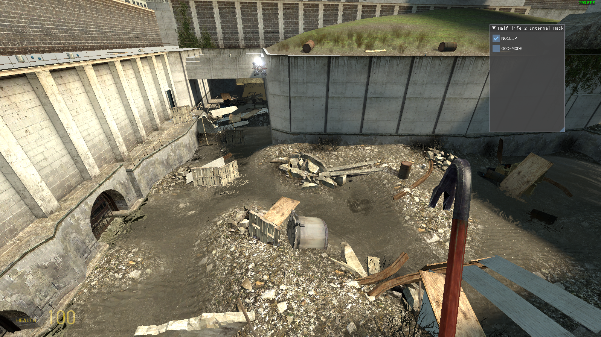

This project is dedicated to the reverse engineering of Half Life 2, an old game. The goal is to learn more about reverse engineering, decompiling, and understanding the internal workings of the game.

## Project Overview

- **Reversing Tools:** IDA, x64dbg
- **Rendering Library:** ImGui
- **Hooking Library:** MinHook

## Motivation

The primary motivation behind this project is to gain insights into the game's internal structure, functions, and overall organization after compilation. The use of IDA, x64dbg, ImGui for rendering an internal menu, and MinHook for function hooking contributes to a comprehensive exploration of the game's internals.

## Project Structure

- `Half Life 2 Trainer/`: Contains the source code for the project.
- `Half Life 2 Trainer/imgui`: ImGui library for rendering the internal menu.
- `Half Life 2 Trainer/minhook`: MinHook library for function hooking.

## Disclaimer

This project is purely for educational purposes. Respect the intellectual property rights of the original game developers.

## Preview

